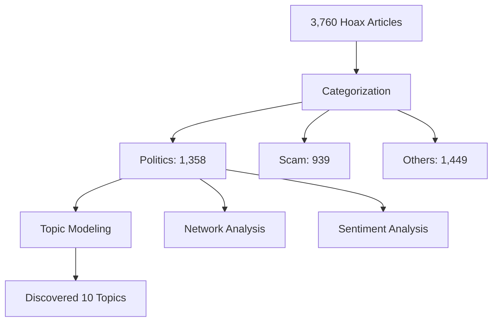
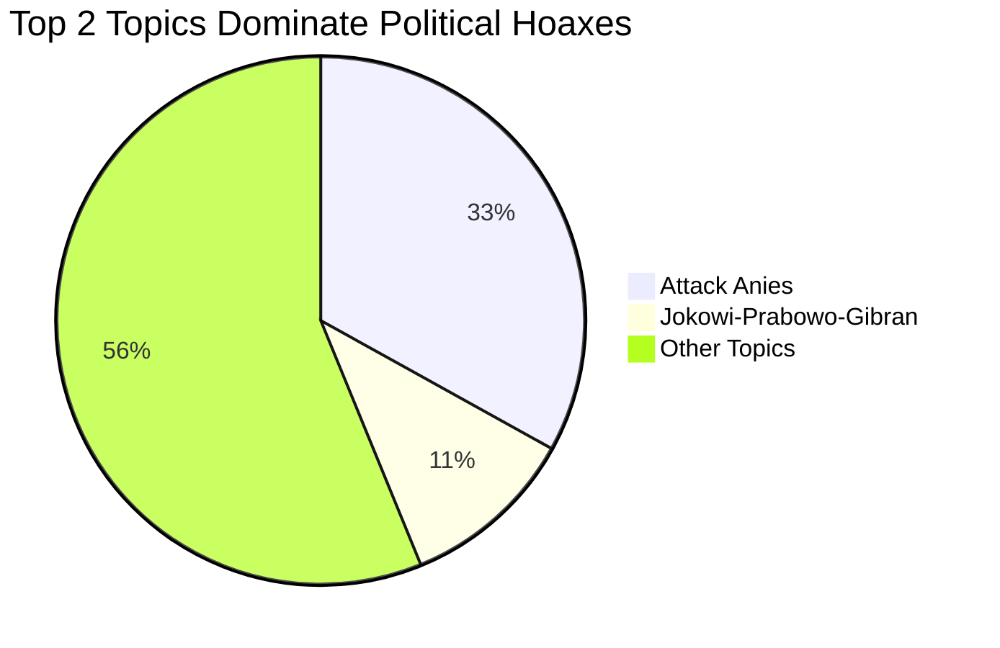
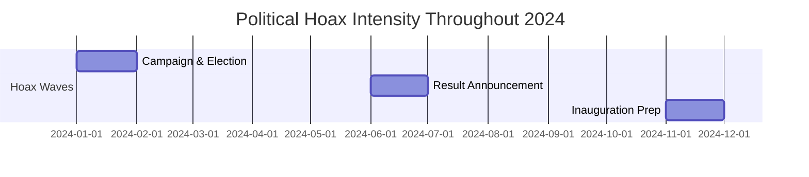

In 2024, Indonesia held what was described as the world's largest single-day election (South China Morning Post, 2024)[^1]. But alongside the democratic process, another battle was raging: the fight against hoaxes.

With 185.3 million Indonesians online (66.5% of the population) and 46% getting their news from social media (We Are Social, 2024; Reuters Institute, 2024)[^2][^3], fake news spread like wildfire. We analyzed 3,760 hoax articles to understand what was really happening. Here's what we found.

> Important URLs:
> - [Source Code ↗](https://github.com/alharkan7/turnbackhoax-analysis)
> - [Topic Modeling Explorer ↗](https://www.raihankalla.id/turnbackhoax-analysis)
> - [Raw Data ↗](https://docs.google.com/spreadsheets/d/1uDFRbWFzMJjYxs1D13o79g726uROOVcJj41B4axGmWU)
> - [Web Scraper ↗](https://colab.research.google.com/drive/1U-oBI_jJHBdmZX0rJA6S3IIMNausLU_m)
> - [Network Analysis ↗](https://www.raihankalla.id/turnbackhoax-text-network)
> - [Sentiment Analysis ↗](https://www.raihankalla.id/turnbackhoax-sentiment-analysis)

## The Research: What We Did

### Data Collection

We gathered all hoax reports from **turnbackhoax.id** throughout 2024. This platform is run by MAFINDO (Masyarakat Antifitnah Indonesia), Indonesia's leading fact-checking organization partnering with the International Fact-Checking Network (MAFINDO, 2023)[^4]. Think of it as the country's hoax archive, every fake news story that was debunked and documented.

**Our dataset:**
- 3,760 hoax articles
- January to December 2024
- Covering the entire election year

### The Analysis Process

We used three main analysis methods:

1. **Topic Modeling** - Finding hidden themes in political hoaxes
2. **Text Network Analysis** - Mapping connections between entities
3. **Sentiment Analysis** - Understanding emotional tones

But in this post, we'll focus on the most revealing part: **what topics dominated political hoaxes** during the election.

## What We Found: Three Types of Hoaxes

We sorted all hoaxes into three categories:

| Category | Count | Percentage | What It Covers |
|----------|-------|------------|----------------|
| **Politics** | 1,358 | 36.2% | Election candidates, parties, political institutions |
| **Others** | 1,449 | 38.7% | Health, disasters, religion, international news |
| **Scam** | 939 | 25.1% | Financial fraud, fake job offers, investment schemes |

Political hoaxes took the biggest share, a third of all fake news in 2024. This makes sense. Election years are prime time for misinformation. The Indonesian Ministry of Communication and Information documented 203 election-related misinformation cases in January 2024 alone, distributed through 2,882 digital content pieces across various platforms (Antara News, 2024)[^5].

## Deep Dive: The 10 Topics in Political Hoaxes

We used a technique called **Latent Dirichlet Allocation (LDA)** to discover hidden topics (Blei et al., 2003)[^6]. Think of it like this: if you read thousands of hoax articles, what patterns emerge?

The computer found **10 distinct topics**:

### The Big Two: Where Most Hoaxes Concentrated

**Topic #5: Attacks on Anies Baswedan** 
- **449 documents (33.1%)**
- The single biggest topic
- Mostly false claims about what Anies said or did
- Questioning his competence and loyalty

**Topic #8: The Jokowi-Prabowo-Gibran Dynasty**
- **146 documents (10.8%)**
- Stories about political succession
- Nepotism allegations
- Support and criticism mixed together

### The Striking Imbalance

Here's the shocking part: **Anies received 3 times more hoax attacks** than the government coalition.

- Hoaxes targeting Anies: **449**
- Hoaxes about Jokowi-Prabowo-Gibran: **146**
- Ratio: **3:1**

This wasn't random. This pattern suggests a **coordinated disinformation campaign** (Subekti et al., 2025)[^7].

### The Smaller Topics: Death by a Thousand Cuts

The remaining topics targeted Indonesia's democratic institutions:

| Topic | Focus | Impact |
|-------|-------|--------|
| #0 | Fake social media content | Manipulated screenshots, imposter accounts |
| #1 | Palace appointments | Nepotism claims |
| #2 | Foreign interference | China conspiracy theories |
| #3 | Parliament budget | Misuse of public funds |
| #4 | Anti-corruption protests | KPK failures |
| #7 | Election manipulation | Fake evidence of fraud |
| #9 | Election commission | Claims of KPU bias |

These smaller topics (only 222 documents total) worked differently. Instead of attacking one person, they eroded trust in the **entire system**.

### Topic Timeline: When Hoaxes Peaked

Hoaxes weren't spread evenly. They surged during three critical moments:

1. **January-February** - Campaign season and election day
2. **June-July** - Official results and transition
3. **November-December** - Presidential inauguration and local elections

The pattern is clear: hoaxes follow political events.

## How Hoaxes Manipulate Emotions

The research revealed that Indonesian political hoaxes exploit specific moral and emotional triggers based on Moral Foundations Theory (Graham et al., 2013)[^8]:

### The Three Main Tactics

**1. Loyalty Attacks** ("Is this person really on our side?")
- Stories about foreign interference
- Claims of China involvement
- Questions about national loyalty

These activate the **Ingroup/Loyalty** moral foundation, particularly effective in Indonesia's collectivistic society (Graham et al., 2013)[^8].

**2. Authority Undermining** ("Can we trust our institutions?")
- Fake news about KPU (Election Commission)
- False claims about DPR (Parliament)
- Stories delegitimizing KPK (Anti-Corruption Commission)

This exploits the **Authority/Respect** foundation, gradually eroding institutional trust.

**3. Fairness Violations** ("They're stealing from us!")
- Exaggerated stories about official salaries
- Fake budget misuse claims
- False election fraud allegations

These trigger the **Fairness/Reciprocity** foundation through narratives of injustice and corruption.

These tactics work because they trigger strong emotions. Research shows that each moral-emotional word in a message can increase its sharing probability by 20% (Brady et al., 2017)[^9]. When you feel betrayed or angry, you're more likely to share content, even without checking if it's true.

## Why This Matters

### The Real-World Impact

**Unequal Playing Field**
When one candidate faces 3x more hoax attacks, the election isn't fair. Voters exposed to repeated misinformation develop negative impressions, even after hoaxes are debunked. This phenomenon, known as the "continued influence effect," means corrections often fail to fully eliminate the impact of misinformation (Lewandowsky et al., 2012)[^10].

**Eroding Trust**
When hoaxes constantly attack institutions (KPU, DPR, KPK), people lose faith in democracy itself. This creates space for authoritarian alternatives. In a context where only 35% of Indonesians trust mass media (Reuters Institute, 2024)[^3], this institutional erosion is particularly dangerous.

**Social Division**
Morally-charged hoaxes don't just change opinions. They increase affective polarization, hostility toward opposing groups, without necessarily changing policy positions (Brady et al., 2019)[^11]. This polarization outlasts any single election.

### The Social Media Amplification

Why did hoaxes spread so effectively? Indonesia's digital landscape (We Are Social, 2024)[^2]:

- **90.9%** use WhatsApp
- **85.3%** use Instagram  
- **81.6%** use Facebook

These platforms' algorithms favor emotional content. The MAD (Motivation-Attention-Design) model explains how moralized content spreads: users are motivated to signal moral identity, algorithms grant attention to high-engagement content, and platform design features enable rapid sharing (Brady et al., 2020)[^12]. Hoaxes designed to trigger moral outrage get massive engagement, which makes the algorithm show them to more people. It's a vicious cycle.

## What Can We Do?

### For Readers

1. **Pause before sharing** - Especially when content makes you angry
2. **Check sources** - Visit turnbackhoax.id when something seems off
3. **Understand the pattern** - Now you know how hoaxes manipulate emotions

### For Platforms

1. **Reduce inflammatory content** - Adjust algorithms to stop rewarding outrage
2. **Add friction** - Make users think before sharing political content
3. **Be transparent** - Share data on coordinated disinformation campaigns

### For Institutions

1. **Rapid response** - Debunk hoaxes quickly during critical periods
2. **Moral reframing** - Counter hoaxes using the same emotional appeals, but truthfully
3. **Media literacy** - Teach people how emotional manipulation works

## The Bottom Line

This research analyzed 3,760 hoaxes to reveal a sobering truth: **Indonesia's 2024 election was fought on two fronts**, the ballot box and the information battlefield.

Political hoaxes in Indonesia aren't random. They're strategic weapons that:
- Target specific candidates asymmetrically
- Exploit Indonesian cultural values about loyalty and authority
- Deliberately erode trust in democratic institutions
- Peak at politically critical moments

The good news? Understanding these patterns is the first step to defending against them.

Next time you see viral political content that makes you angry, remember: **you might be looking at one of these 1,358 political hoaxes**. Take a breath. Check the facts. Don't let yourself become part of the problem.

---

**Acknowledgments:**
1) *Special thanks to MAFINDO (Masyarakat Antifitnah Indonesia) for their tireless work documenting and debunking hoaxes, making research like this possible.*
2) *This blog post was written with assistance from generative AI, which was used for outlining the structure, gathering supporting data, and creating visual diagrams.*

---

[^1]: South China Morning Post. (2024, February 13). Indonesia election 2024: Everything you need to know about the world's largest single-day vote. https://www.scmp.com/week-asia/explained/article/3251796/indonesia-election-2024-everything-you-need-know-about-worlds-largest-single-day-vote

[^2]: We Are Social. (2024). Digital 2024 Indonesia: The essential guide to the latest connected behaviours. https://wearesocial.com/id/wp-content/uploads/sites/19/2024/02/Digital_2024_Indonesia.pdf

[^3]: Reuters Institute. (2024). Digital News Report 2024: Indonesia. Reuters Institute for the Study of Journalism. https://databoks.katadata.co.id/en/technology-telecommunications/statistics/c967c03e4982ab0/public-trust-in-indonesian-mass-media-declines-in-2024

[^4]: Masyarakat Anti Fitnah Indonesia (MAFINDO). (2023). Tentang Mafindo. https://mafindo.or.id/tentang-mafindo/

[^5]: Antara News. (2024). Kominfo Ministry handles 203 election hoax-related issues. Antara News. https://en.antaranews.com/news/302382/kominfo-ministry-handles-203-election-hoax-related-issues

[^6]: Blei, D. M., Ng, A. Y., & Jordan, M. I. (2003). Latent Dirichlet allocation. *Journal of Machine Learning Research*, 3, 993–1022.

[^7]: Subekti, D., Yusuf, M., Saadah, M., & Wahid, M. (2025). Social media and disinformation for candidates: The evidence in the 2024 Indonesian presidential election. *Frontiers in Political Science*, 7, 1625535. https://doi.org/10.3389/fpos.2025.1625535

[^8]: Graham, J., Haidt, J., Koleva, S., Motyl, M., Iyer, R., Wojcik, S. P., & Ditto, P. H. (2013). Moral foundations theory: The pragmatic validity of moral pluralism. *Advances in Experimental Social Psychology*, 47, 55-130. https://doi.org/10.1016/B978-0-12-407236-7.00002-4

[^9]: Brady, W. J., Wills, J. A., Jost, J. T., Tucker, J. A., & Van Bavel, J. J. (2017). Emotion shapes the diffusion of moralized content in social networks. *Proceedings of the National Academy of Sciences*, 114(29), 7313-7318. https://doi.org/10.1073/pnas.1618923114

[^10]: Lewandowsky, S., Ecker, U. K. H., Seifert, C. M., Schwarz, N., & Cook, J. (2012). Misinformation and its correction: Continued influence and successful debiasing. *Psychological Science in the Public Interest*, 13(3), 106-131. https://doi.org/10.1177/1529100612451018

[^11]: Brady, W. J., & Crockett, M. J. (2019). How effective is moral reframing? Evidence that moral reframing shifts attitudes by changing the perceived morality of the policy. *Proceedings of the National Academy of Sciences*, 116(21), 10304-10309. https://doi.org/10.1073/pnas.1917928116

[^12]: Brady, W. J., Crockett, M. J., & Van Bavel, J. J. (2020). The MAD model of moral contagion: The role of motivation, attention, and design in the spread of moralized content online. *Perspectives on Psychological Science*, 15(4), 978-1010. https://doi.org/10.1177/1745691620917336
