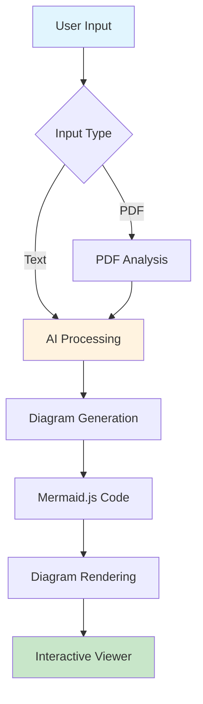

I must confess, I only learned about Mermaid diagrams a few days ago, all thanks to Claude. I was fascinated by how Claude could answer my questions not just with text, but by seamlessly giving me illustrative diagrams directly into its responses. It was eye-opening.

I was getting curious, so I immediately dug into how Claude did this, wanting to have that same capability consistently available whenever I asked a question. What if I could always get an instant, illustrative diagram to explain an idea?

That's when the I got the idea for **Inztagram**. I decided I had to build an app that could do just that: generate instant diagrams from simple descriptions.

Here's the simple architecture of how Inztagram works:

And here's the launch ~~video~~ meme:

<blockquote class="twitter-tweet" data-media-max-width="560">
<a href="https://t.co/G23nvnISLR">https://t.co/G23nvnISLR</a>    Here&#39;s the launch video: <a href="https://t.co/VHDt7ky340">pic.twitter.com/VHDt7ky340</a>
&mdash; Al Harkan (@alhrkn) <a href="https://twitter.com/alhrkn/status/1927376849220293096?ref_src=twsrc%5Etfw">May 27, 2025</a></blockquote>

  
---

I hope this app is useful for you. If you have any questions or feedback, please let me know [@alhrkn](https://x.com/alhrkn).