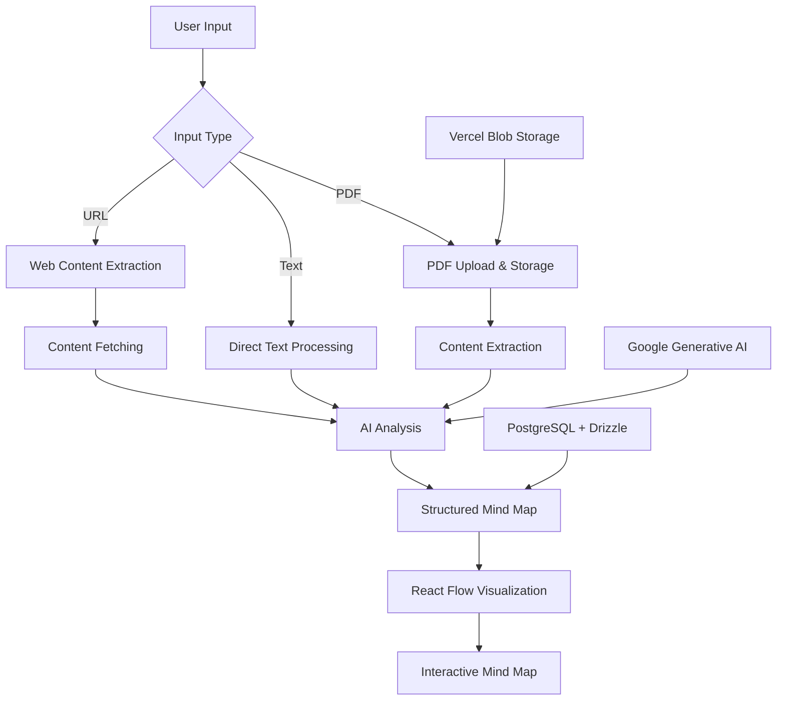

Reading research papers is a pain. We're scrolling through pages, trying to connect ideas across sections, and by the time we finish, we've forgotten half of what we read. It's like trying to build a house while someone keeps moving the foundation.

Traditional reader apps treat documents as static, linear text. But knowledge isn't linear—it's interconnected. When I was researching, I always found myself creating messy hand-drawn mind maps just to understand how concepts related to each other.

That's when I realized: what if we could automatically extract the structure from any document and turn it into a mind map? Even better, what if the mind map is interactive and we can 'ask' follow up questions?

**So I created [Papermap](https://alhrkn.vercel.app/papermap), an app that does just that.** You can try it out here:

## [apps.raihankalla.id/papermap ↗](https://alhrkn.vercel.app/papermap)

  

Here's the launch video - Part 1:

<blockquote class="twitter-tweet" data-media-max-width="560">
Introducing Papermap —my 13th experimental app.    This is how students &amp; researchers can read &amp; understand any paper 10x faster.    Turn any PDF into an interactive AI mindmap, getting you up to speed on the entire paper at a glance, then dive into the details visually.    Link ↓ <a href="https://t.co/FRrvMUg456">https://t.co/FRrvMUg456</a> <a href="https://t.co/ehMqOsKt91">pic.twitter.com/ehMqOsKt91</a>
&mdash; Al Harkan (@alhrkn) <a href="https://twitter.com/alhrkn/status/1908763370968297586?ref_src=twsrc%5Etfw">April 6, 2025</a></blockquote>

Part 2:

<blockquote class="twitter-tweet" data-media-max-width="560">
What if ChatGPT always answered in mindmaps?     This is the next iteration of Papermap. It can now answer any question and process any URL.    Enjoy ↓ <a href="https://t.co/SkO6OwCZ0I">https://t.co/SkO6OwCZ0I</a> <a href="https://t.co/Fm1WxT7TZs">pic.twitter.com/Fm1WxT7TZs</a>
&mdash; Al Harkan (@alhrkn) <a href="https://twitter.com/alhrkn/status/1912148258815906008?ref_src=twsrc%5Etfw">April 15, 2025</a></blockquote>

  
---

And here's the brief technical overview on how it works:

  

Most AI tools give you a summary or extract key points. Papermap creates a hierarchical structure that reflects how concepts actually relate to each other. It's like having a research assistant who not only reads the paper but also creates a perfect outline.

And the best part, the mind map isn't static. You can:
- Click nodes to expand descriptions
- Collapse branches to focus on specific areas
- Ask follow-up questions about any node
- Navigate between the mind map and original content
- Switch between different layout styles

You can also provide more than just PDFs. You can input text questions, paste URLs, or upload documents. This makes it versatile for different use cases—from academic research to content analysis to idea organization.

  
I hope this tool is useful for you. If you have any questions or feedback, please let me know [@alhrkn](https://x.com/alhrkn).