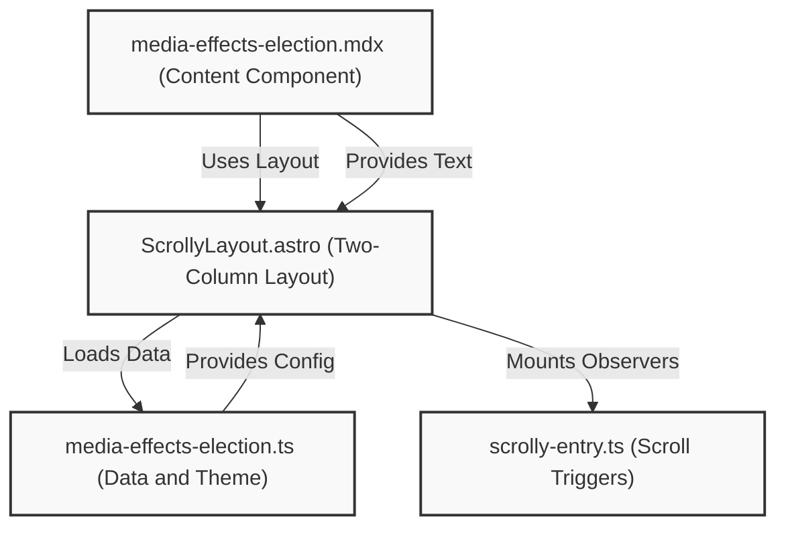

When disseminating a research, a standard article or rigid PDF report often fall short. Let's be real, it's boring and readers can easily get lost in dense paragraphs or detached visualizations that sit far away from the context they are meant to explain. 

This was the challenge I faced when deciding how to present my 2019 thesis. The solution I turned to was scrollytelling, a technique that synchronizes scrolling text with dynamic, sticky visualizations. 

You can see the result in action on this page, [**Beyond the Screen: Media Effects on Voter Turnout & Vote Direction in Indonesia's 2019 Legislative Election**](/media-effects-election). As you scroll through the narrative, the charts on the right smoothly transition, highlight critical data points, and redraw themselves to reflect the specific paragraph you are reading. 

If you have ever wondered how a responsive, data-driven scrollytelling page like that is built under the hood using [Astro](https://astro.build/), [MDX](https://mdxjs.com/), and [D3.js](https://d3js.org/), this post will walk you through the architecture.

## The Architecture

At its core, the mechanism is designed around a clean separation of concerns. The goal is to keep the writing process simple while allowing the presentation layer to handle the complex choreography of updating visualizations.

> If you prefer to dig straight into the code rather than reading the breakdown, you can directly explore and dissect the primary source file for the article here on GitHub: **[`media-effects-election.mdx`](https://github.com/alharkan7/alharkan7.github.io/blob/main/src/posts/scrolly/media-effects-election.mdx)**

Rather than cramming everything into a single file, the architecture relies on four distinct supporting pillars:
1. [**The Content Component (MDX)**](https://github.com/alharkan7/alharkan7.github.io/blob/main/src/posts/scrolly/media-effects-election.mdx): Holds the written narrative and section triggers.
2. [**The Data Configuration (TypeScript)**](https://github.com/alharkan7/alharkan7.github.io/blob/main/src/scrolly/data/media-effects-election.ts): Stores the raw numbers, themes, and visualization settings.
3. [**The Scrolly Layout (Astro)**](https://github.com/alharkan7/alharkan7.github.io/blob/main/src/layouts/ScrollyLayout.astro): Assembles the two-column grid and dynamically links the data to the layout.
4. [**The Client Script (TypeScript/D3.js)**](https://github.com/alharkan7/alharkan7.github.io/blob/main/src/scrolly/scrolly-entry.ts): Observes the user's scroll position and animates the charts.

Here is a visual roadmap of how the various pieces of a scrollytelling page interact in this project:



Let's break down each of these components to see how they work together.

## Writing the Narrative in MDX

The journey begins with the content. We use an MDX file [`src/posts/scrolly/media-effects-election.mdx`](https://github.com/alharkan7/alharkan7.github.io/blob/main/src/posts/scrolly/media-effects-election.mdx) as the entry point. The beauty of MDX is that it allows us to interweave standard Markdown with custom components.

At the very top, the frontmatter tells Astro which layout to use and provides an identifier for the data file:

```yaml
---
layout: ../../layouts/ScrollyLayout.astro
configId: media-effects-election
---
```

Rather than burdening the writer with complex HTML layouts or raw chart data directly in the document, the narrative is simply wrapped in a structural component called `<ScrollySection>`.

```mdx
import ScrollySection from '../../components/scrolly/ScrollySection.astro';

<ScrollySection id="context">
  <div class="section-label">Section 01</div>
  ## The New Democratic Landscape
  
  Since the 1998 *Reformasi*, Indonesia's media landscape has undergone a radical transformation.
</ScrollySection>
```

The `id="context"` acts as a crucial anchor. When the reader scrolls down and this specific text block enters the viewport, it sends a signal to trigger the corresponding visualization linked to the `"context"` identifier.

## Isolating Data in TypeScript Configuration

To preserve the readability of the MDX file, all the heavy lifting for the charts is extracted into a dedicated configuration file [`src/scrolly/data/media-effects-election.ts`](https://github.com/alharkan7/alharkan7.github.io/blob/main/src/scrolly/data/media-effects-election.ts).

Because we provided the `configId` in the MDX frontmatter, Astro knows exactly which TypeScript file to import. This configuration object is the brain of the visualizations. It stores the hero metadata, the overall theme, and most importantly, an array of configuration options mapping to every `<ScrollySection>` ID found in the text:

```typescript
export const config = {
  // Metadata and Hero configuration...
  sections: [
    {
      id: "context",           // Maps to the MDX <ScrollySection id="context">
      navLabel: "Context",
      viz: {
        key: "bubbles",        // Dictates which chart type to render
        title: "Indonesia's Media Growth, 2000–2019",
        mount: "svg",          // Mounts onto an SVG element
        props: {
          series: ["internet", "tv", "radio"],
          data: [
            { year: 2000, internet: 1.9, tv: 88, radio: 68 },
            // ... the rest of the dataset
          ]
        }
      }
    }
  ]
}
```

This setup defines everything from what type of chart needs to be loaded (such as a line chart, bubble map, or scatter plot) to the raw data meant to populate it, and whether it mounts as an SVG or a standard div.

## The ScrollyLayout Orchestrator

The file `ScrollyLayout.astro` serves as the glue that pulls the narrative and the data together. 

First, it relies on Vite's `import.meta.glob` to dynamically import the TypeScript configuration file based on the MDX file's frontmatter:

```javascript
const allConfigs = import.meta.glob('../scrolly/data/*.ts', { eager: true });
const configPath = `../scrolly/data/${frontmatter.configId}.ts`;
const config = allConfigs[configPath].config;
```

With the data loaded, the layout establishes the classic scrollytelling structure: a two-column interface. 
- **The Text Column:** A scrolling area on the left where the `<slot />` renders all the headings and paragraphs from the MDX file.
- **The Sticky Column:** A visually locked area on the right where `position: sticky` keeps the charts smoothly centered on the screen.

Inside this sticky column, the layout iterates over the configurations array and creates a container for each visualization.

```jsx
<div id="viz-panels-container">
  {page.sections.map((s) => (
    <div id={`viz-${s.id}`} data-viz-key={s.viz.key}>
      <div class="viz-title">{s.viz.title}</div>
      {s.viz.mount === "svg" ? (
        <svg id={vizMountId(s.viz.key)}></svg>
      ) : (
        <div id={vizMountId(s.viz.key)}></div>
      )}
      <script type="application/json" data-viz-props set:html={safeJson(s.viz.props)}></script>
      <div class="viz-caption">{s.viz.captionHtml}</div>
    </div>
  ))}
</div>
```

A particularly effective pattern used here is generating `<script type="application/json">` tags dynamically and dumping the visualization properties directly into them. Instead of trying to hydrate heavy JavaScript-driven components repeatedly on load, the data is securely packaged and delivered straightforwardly from the server to the client's DOM.

## Bringing it to Life on the Client

Everything discussed so far handles the organization and structure. The final piece of the puzzle is the interactivity, managed by a client script embedded at the bottom of the layout:

```html
<script src="../scrolly/scrolly-entry.ts"></script>
```

This client-side orchestrator employs Intersection Observers alongside D3.js. It actively watches the user's scroll depth within the text column. 

When a reader scrolls past a specific anchor, like `<ScrollySection id="finding1">`, the observer detects it. It then assigns an active class to the corresponding `div#viz-finding1` container, parses the embedded JSON data resting in the DOM, and instructs D3 to dynamically draw, animate, or update the chart on the screen.

---

Building a scrollytelling experience this way ensures scalability. Writers can focus entirely on the text in MDX, analysts can manage the numbers in isolated TypeScript files, and the underlying Astro orchestration engine smoothly connects the two worlds. Next time you need to present complex findings, a tailored narrative layout might just be the key to keeping your audience engaged. 

I shared this architecture hoping it contributes to better science dissemination. As researchers, the data we collect is powerful, but it's the way we tell the story that truly makes an impact. 

If you have any questions about this setup, want to dive deeper into the code, or just want to chat about data storytelling, don't hesitate to reach out to me here: [@alhrkn](https://instagram.com/alhrkn).
