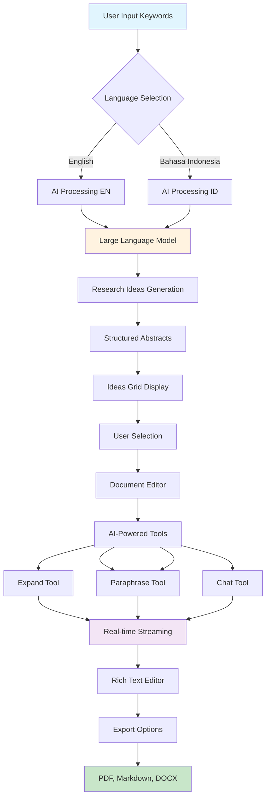

With the arrival of LLMs, most work that involves typing on a computer is gradually becoming obsolete, and that includes many of our traditional research workflows. However, this also opens up opportunities to adapt this technology, freeing researchers from boring administrative tasks to let them focus on the substantial research ideas themselves. It gives them a tool for rapid iteration on multiple research ideas at once.

Some tools have arrived and look promising, like Jenni AI. But I dislike that these tools are not open-source and do not embody the spirit of open knowledge.

I've been waiting for months for the "Lib Gen & Sci-Hub" of these AI research tools to appear, but I've grown tired of waiting as none have emerged. So, I'm building one.

  

  <iframe 
    style="position: absolute; top: 0; left: 0; width: 100%; height: 100%;" 
    src="https://www.youtube.com/embed/YjCXcdyAWuU?si=ciQjAIlIAFab2Qu6" 
    title="YouTube video player" 
    frameborder="0" 
    allow="accelerometer; autoplay; clipboard-write; encrypted-media; gyroscope; picture-in-picture; web-share" 
    referrerpolicy="strict-origin-when-cross-origin" 
    allowfullscreen>
  </iframe>

  

Here's the simple architecture of how Outliner works.

This is my 15th experimental app, but as always, I hope it's useful to you. Please give Outliner a try here:

## [apps.raihankalla.id/outliner ↗](https://alhrkn.vercel.app/outliner)

If you have any questions or feedback, please let me know [@alhrkn](https://x.com/alhrkn).
